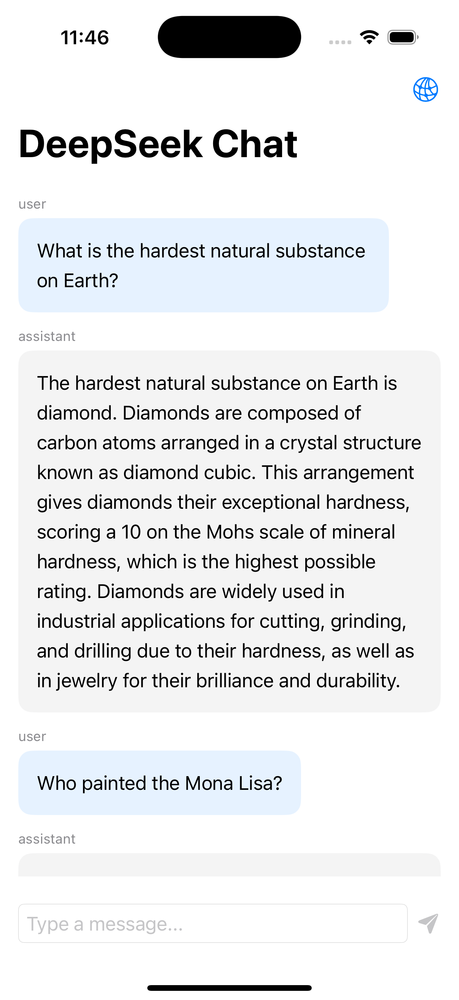
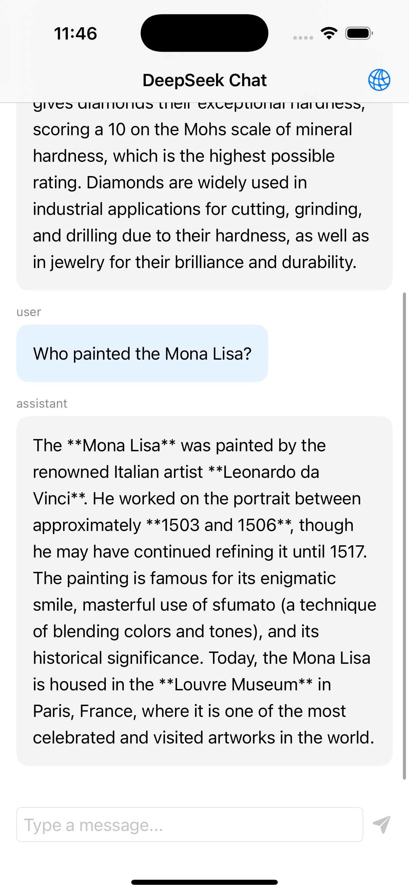

# DeepSeekClient

A modern Swift package for interacting with DeepSeek's API, showcasing latest Swift features and best practices.

## Features

- ✨ Full async/await support
- 🔐 Actor-based thread safety
- 🎯 Sendable type compliance
- 📦 Swift Package Manager support
- 🧪 Modern Swift Testing framework
- 🔄 Comprehensive error handling
- 📱 iOS 13.0+ & macOS 10.15+ support

## Installation

### Swift Package Manager

Add this dependency to your `Package.swift`:

```swift
dependencies: [
    .package(url: "https://github.com/ganeshwaje/DeepSeek-iOS-Client.git", from: "1.0.0")
]
```

Or via Xcode:
1. File > Add Packages
2. Enter repository URL
3. Select version requirements

## Quick Start

```swift
// Initialize client
let config = DeepSeekClient.Configuration(
    apiKey: "your-api-key"
)
let client = DeepSeekClient(configuration: config)

// Make a chat request
let request = ChatCompletionRequest(
    messages: [
        ChatMessage(role: "user", content: "Hello!")
    ],
    temperature: 0.7
)

do {
    let response = try await client.chat(request)
    print(response.choices.first?.message.content ?? "No response")
} catch {
    print("Error: \(error)")
}
```

## Modern Swift Features Showcase

### Actor-based Thread Safety

```swift
public actor DeepSeekClient {
    private let apiKey: String
    private let session: URLSession
    
    public func chat(_ request: ChatCompletionRequest) async throws -> ChatCompletionResponse {
        // Thread-safe implementation
    }
}
```

### Sendable Compliance

```swift
public struct Configuration: Sendable {
    let apiKey: String
    let baseURL: URL
}

public struct ChatMessage: Codable, Sendable {
    public let role: String
    public let content: String
}
```

### Async/Await Network Calls

```swift
private func performRequest(_ request: URLRequest) async throws -> (Data, URLResponse) {
    if #available(iOS 15.0, macOS 12.0, *) {
        return try await session.data(for: request)
    } else {
        return try await withCheckedThrowingContinuation { continuation in
            let task = session.dataTask(with: request) { data, response, error in
                // Continuation handling
            }
            task.resume()
        }
    }
}
```

### Comprehensive Error Handling

```swift
public enum DeepSeekError: Error {
    case invalidURL
    case invalidResponse
    case requestFailed(Error)
    case decodingFailed(Error)
    case apiError(String)
}
```

## Example App Integration

Check out the example app in the repository for a complete SwiftUI implementation featuring:
- Network request monitoring with Netfox
- Loading animations
- Error handling
- SwiftUI Navigation
- MVVM architecture

## Screenshots

&nbsp;&nbsp;&nbsp;&nbsp;

## Requirements

- iOS 13.0+ / macOS 10.15+
- Swift 5.7+
- Xcode 14.0+

## License

This project is licensed under the MIT License - see the LICENSE file for details.
